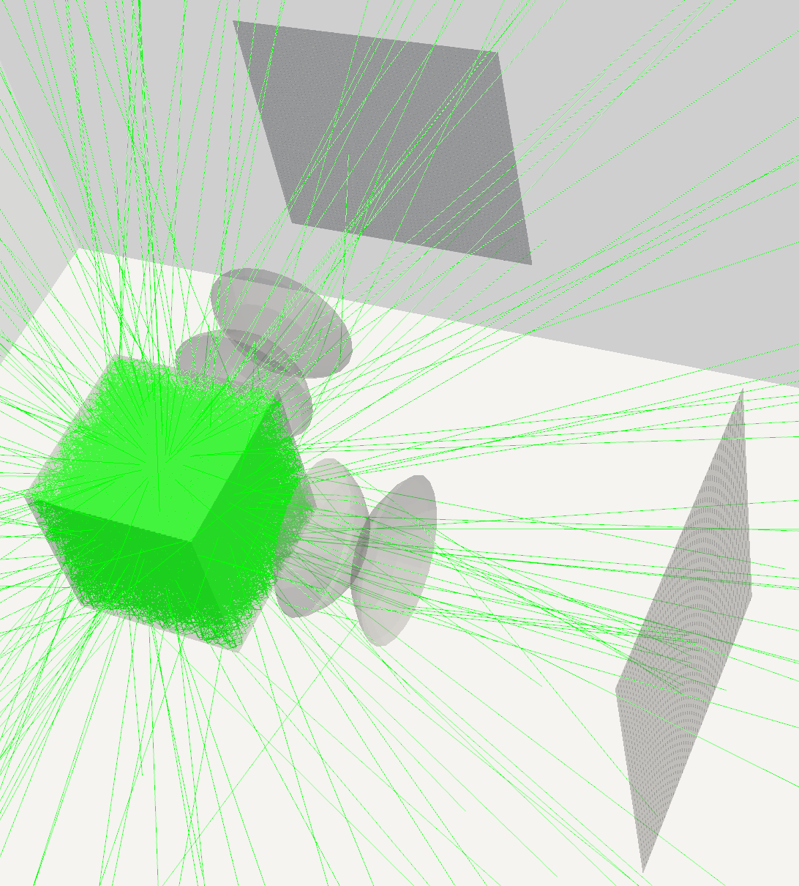

# Riptide Optics

## Overview
Riptide Optics is a project dedicated to simulating optical systems using the Geant4 toolkit. The goal is to deliver precise and efficient simulations for a variety of optical configurations, aiding in the design and analysis of optical systems.


## Requirements
- Geant4
- CMake
- Ninja

## Installation
Create a build directory and compile the project using CMake:
```sh
cmake -S . -B build -DGeant4_DIR=~/path/to/cmake/Geant4/ -G"Ninja Multi-Config"
cmake --build build --config Release
```

## Usage
To run the simulation, execute the following command:
```sh
build/simulate
```

The simulation generates a 2D histogram `output.root`, which contains a matrix recording the optical photons' interactions.

